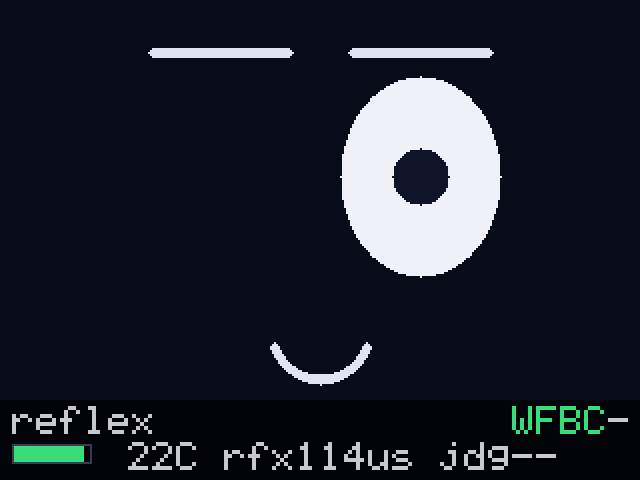
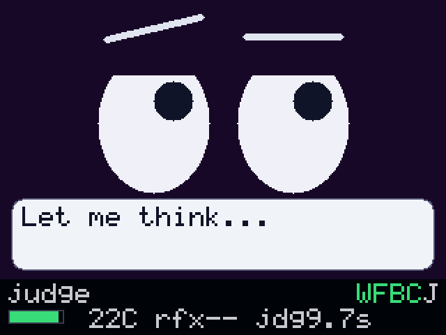
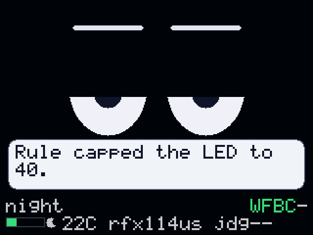
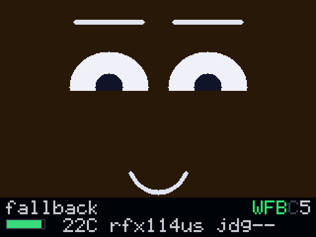
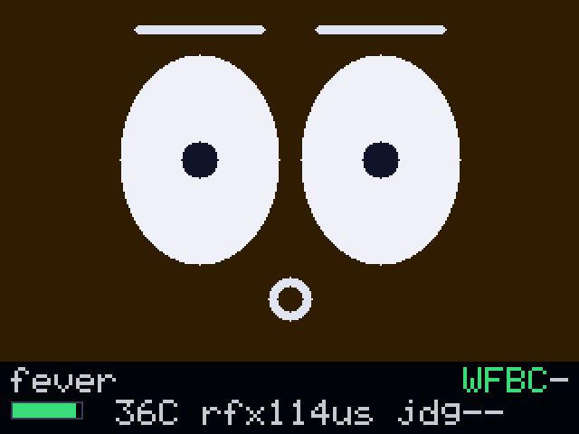
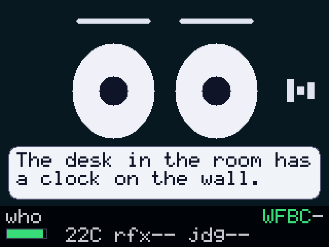
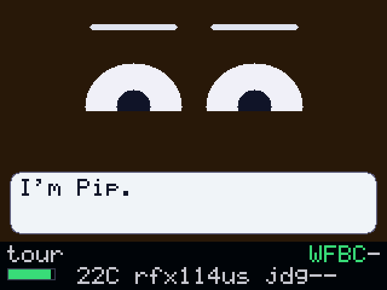
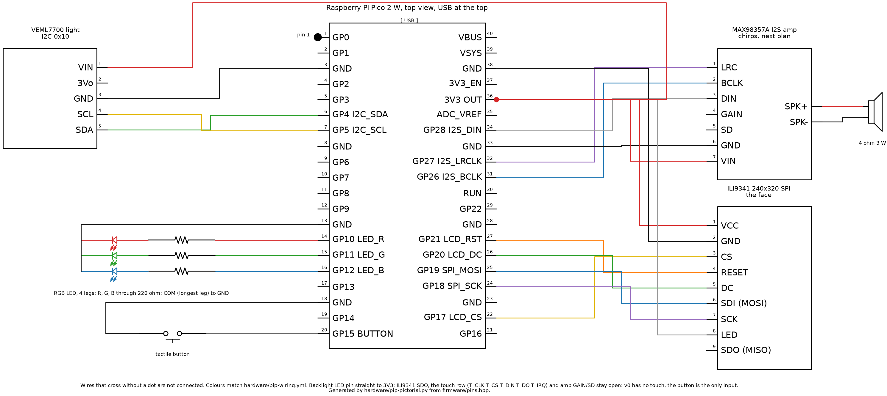

# Pip

A desk companion with a face. Pico 2 W body, tiny_agent brain, rete_cpp
reflexes. Press its button and it winks before you let go: that reaction is
a Rete rule firing in microseconds, zero tokens. Hold the button and it
thinks; that one is an LLM agent choosing an expression, a chirp, and a
mood color.

Status: body firmware v1 with sound. The face has brows, a mouth, ten moods, a
speech bubble and a status strip; a framed UART link carries commands, events
and speech PCM to and from the brain, with HTTP kept for config, debug and as
the fallback when the wire is dead; six synthesized chirps and streamed speech
come out of a MAX98357A over I2S, and the mouth moves while they do. It builds
warning-free in three configs (full, `PIP_LITE`, and the I2S audio smoke).
Design spec:
[tiny_agent](https://github.com/tinyagent-cc/tiny_agent)
`docs/superpowers/specs/2026-08-23-pip-wow-demo-design.md`.

## Anatomy of Pip

Four boxes, one desk. Reflexes are rules and run on the Pi Zero in
microseconds. Judgment is an agent, runs on the Jetson, and costs seconds.
When the Jetson is gone the Pi 5 answers instead. The Pico only ever shows,
sounds and senses, which is why the face loop never waits on the LAN.

| Device | Role | What runs on it | Link |
|---|---|---|---|
| Pico 2 W | body | `firmware/`: face, HUD, speech bubble, button, light and temperature | UART0 at 921600 to the Zero; WiFi HTTP for config, debug and as the fallback |
| Pi Zero 2 W | brain | `brain/pip-brain`: rete_cpp reflex rules, the tiny_agent judgment loop, the scene director | the wire to the Pico, LAN to the Jetson and the Pi 5 |
| Jetson Orin Nano | cortex | `services/cortex` on :8090 (`/listen`, `/see`), llama-server text on :8081, VLM on :8082, whisper.cpp CUDA | LAN |
| Pi 5 | fallback mind and voice | `services/voice` on :8091 (Piper TTS), llama-server on :8081 | LAN |

### How a press becomes a wink

1. The button FSM debounces the press and raises `button.press` on the body.
2. The body puts the event on the wire when a good frame arrived in the last
   two seconds, and `POST`s it to the brain over HTTP when it did not.
3. The brain's rete network matches `press-wink`. No model call, no tokens.
4. The rule writes `{"cmd":"express","emotion":"wink"}` back down the same wire.
5. The face flips to the wink shape, holds it three seconds, and falls back to
   idle (to sleepy while the light sensor says the room is dark).
6. The brain pushes `reflex_us` to the HUD, so the number is on the screen a
   frame later.

Measured at the brain with the body answering over HTTP: **757 ms**. Over the
wire the same path is a rule match plus one UART frame, which is where the
microseconds claim comes from. The bench has not timed that yet:
`{{wire_reflex_us}}`.

### How a hold becomes an answer

1. Holding the button 1.5 s raises `button.hold`.
2. `hold-listen` fires first, still a rule: listening face, `rise` chirp.
3. The brain asks the cortex for four seconds of microphone and gets a
   transcript back (`/listen`, 4.5 s for 3 s of audio, whisper `base.en` on
   CUDA).
4. The face turns to thinking and the agent runs on the Jetson's
   Qwen2.5-3B-Instruct with six tools. One of them is `look`, which goes back
   to the cortex for a camera frame and a VLM sentence (`/see`, 2.6 s end to
   end, about 1.0 s once the VLM is warm).
5. The answer goes to the Pi 5's Piper (`/tts`, 194 ms of synthesis for a
   1.19 s clip) and streams to the body as PCM while the bubble shows the same
   text.
6. The HUD gets `judge_ms` and `mind`.

Measured end to end on 2026-08-23 with the Jetson up: **9.8 s**, `judge_ms`
9758, `mind` `J`. The three Jetson processes hold about 4.09 GB resident
against a 6.5 GB budget, which is what leaves room for the VLM and whisper to
sit alongside the text model instead of taking turns.

### The scenes

Each one is a script on the brain. `POST /scene` starts it, `GET /scenes`
lists them, and a second scene while one is running gets a 409 with the name
of the scene that has the stage. The frames below are the real screen, dumped
from the same `core/` code the Pico runs, not mockups.

Substitute the Zero's address for `<brain>` throughout.



**`reflex`** asks for a press, waits six seconds for a real one, and stages the
press itself if nobody obliges. The wink is a rule firing. Then it asks you to
hold and ask something, which is the other half of the same scene.

```
curl -X POST http://<brain>:8080/scene -d '{"name":"reflex"}'
```



The second beat of `reflex`: violet thinking face, the bubble carrying what
Pip is about to say, `jdg` and the `J` on the HUD saying the Jetson answered
and how long it took. Nothing on this screen came from a rule.



**`night`** waits for the light sensor to drop, then asks the agent for a
bright red LED and lets the guardrail refuse it. 255 goes in, 40 comes out,
and Pip says so. The moon next to the lux bar is the body's own night flag,
set from the same reading.

```
curl -X POST http://<brain>:8080/scene -d '{"name":"night"}'
```



**`fallback`** tells the judgment layer to skip the Jetson for one answer. The
`C` glyph goes grey and `mind` reads `5`, so the film shows the fallback
without anyone powering a box down mid-take. Pull the Jetson's power if you
want the harder version; the HUD looks the same.

```
curl -X POST http://<brain>:8080/scene -d '{"name":"fallback"}'
```



**`fever`** is the `temp.hot` reflex above the 35 C threshold: alert face, red
LED, no model involved. Warm the chip with a thumb, or let the scene stage the
event after ten seconds.

```
curl -X POST http://<brain>:8080/scene -d '{"name":"fever"}'
```



**`who`** calls `look`, which grabs a frame from the Brio on the Jetson and
asks the VLM for one sentence. The bubble above is a real answer from
2026-08-23, not a caption someone wrote. The waveform glyph on the right is
the listening state.

```
curl -X POST http://<brain>:8080/scene -d '{"name":"who"}'
```



**`tour`** runs about two minutes with nobody at the desk: one sentence per
part, then `reflex`, `night` and `who` with every wait staged. `--tour` on the
brain runs it ten seconds after start, which is what the unattended demo boots
into.

```
curl -X POST http://<brain>:8080/scene -d '{"name":"tour"}'
```

The film script for all of this, with what to say and what to expect back, is
[`docs/demo-script.md`](docs/demo-script.md). Re-render the gallery after a
bench run:

```
cmake -S tests -B build-tests -G Ninja && cmake --build build-tests --target render_frames
(cd build-tests && ./render_frames --scenes --reflex-us <measured> --judge-ms <measured>)
python3 scripts/frames-to-png.py build-tests/frames docs/frames
```

### Where the rest is written down

[`PROTOCOL.md`](PROTOCOL.md) is the wire and HTTP contract.
[`brain/README.md`](brain/README.md) has the endpoints, the flags, the deploy
and the log format. [`services/README.md`](services/README.md) has the cortex
and voice contracts with the measured memory and latency behind every number
above. [`hardware/`](hardware/) has the pin table, the pictorial and the
WireViz harness, all generated from `firmware/pins.hpp`.

## Brain

`brain/` is `pip-brain`: reflex rules (rete_cpp) answer most events in
microseconds, and a tiny_agent judgment loop only wakes on `button.hold`,
which costs seconds and tokens instead. It runs on a Pi Zero 2 W, built on
a Pi 5 and deployed over SSH. Endpoints, flags, build, and deploy:
`brain/README.md`.

## Hardware and wiring

| Part | Role | Pico 2 W pins |
|---|---|---|
| ILI9341 240x320 SPI | the face | SCK GP18, MOSI GP19, CS GP17, DC GP20, RST GP21, LED 3V3, VCC 3V3, GND |
| VEML7700 | ambient light | SDA GP4, SCL GP5, VIN 3V3, GND |
| Tactile button | interaction | GP15 to GND (internal pull-up) |
| RGB LED (4-pin) | mood | R GP10, G GP11, B GP12 through 220 ohm, common to GND |
| MAX98357A + speaker | chirps and speech | BCLK GP26, LRC GP27, DIN GP28, VIN 3V3, GND |
| Pi Zero 2 W (brain) | wire link, live in v1, 921600 8N1 | GP0 TX (pin 1) to Zero pin 10 (GPIO15 RXD), GP1 RX (pin 2) to Zero pin 8 (GPIO14 TXD), pin 3 GND to Zero pin 6 |

Pi Zero header, first ten pins, board seen from above with the SD card to your left
(pin 1 is the square pad nearest the SD card; odd pins are the inner row, even pins the outer row;
`hardware/pip-pictorial.png` shows the same header turned 90 degrees, SD card at the top, all 40 pins named):

```
outer (even):  2 5V   | 4 5V   | 6 GND  | 8 GPIO14 TXD | 10 GPIO15 RXD
inner (odd):   1 3V3  | 3 SDA  | 5 SCL  | 7 GPIO4      |  9 GND
```

Pico GP0 (TX, pin 1) goes to Zero pin 10 (RXD); Pico GP1 (RX, pin 2) to Zero pin 8
(TXD); Pico pin 3 (GND) to Zero pin 6. TX to RX crossed, 3.3 V on both sides. On the
Zero: `dtoverlay=disable-bt` and no serial console, so `/dev/ttyAMA0` is the link.

`firmware/pins.hpp` is the source of truth for this table and for both drawings below.

The hookup, pin by pin. Pico 2 W seen from the top with the USB at the top, pin 1 marked;
each breakout as a box with the pins its header prints; wires that cross without a dot
are not connected. Display pins not drawn (SDO and the touch row T_CLK, T_CS, T_DIN, T_DO,
T_IRQ) stay open; v0 has no touch, the button is the only input:



Generated by `hardware/pip-pictorial.py` ([schemdraw](https://schemdraw.readthedocs.io/),
`pip install schemdraw matplotlib`), which reads `pins.hpp` directly.

The same wiring as a harness with wire colours, lengths, and a parts list:
`hardware/pip-wiring.yml` is the [WireViz](https://github.com/wireviz/WireViz) source,
`pip-wiring.png`/`.svg` and `pip-wiring.bom.tsv` are rendered from it (`pip install wireviz`,
needs Graphviz, then `wireviz hardware/pip-wiring.yml`). `scripts/check_wiring.py` runs in CI
and fails when that file and `pins.hpp` disagree.

Power: the Pico's USB cable is the only supply. 3V3 OUT (pin 36) covers the whole v0
load; no breadboard power module, and never feed an external 5V or 3V3 rail into a Pico
pin. Handy: jumper pin 36 to the breadboard's + rail and pin 38 to the − rail and take
each breakout's VCC/GND from the rails. If the speaker clips when a tone plays, move the
amp's VIN from 3V3 to VBUS (pin 40, USB 5V).

The RGB LED is one 4-leg part (longest leg is COM); the drawing shows its three dies. The
wiring assumes common cathode (`PIP_RGB_COMMON_ANODE 0`). Test: 3V3 through 220 ohm to
the longest leg, one short leg to GND. Lights: common anode, so COM goes to 3V3 and
`PIP_RGB_COMMON_ANODE 1`. Dark: common cathode, wire as drawn.

`PIP_LITE` needs no wiring: a bare Pico 2 W on USB.

Bench signs, learned the hard way:
- Pico 2 W has no power LED; the firmware blinks the onboard green LED at 1 Hz once the main
  loop runs. Not blinking = boot stuck before the loop.
- Boot lines print before USB serial is up and are lost; `pip: event ...` lines on a button
  press carry lux and temp. `lux=-1.0` = VEML7700 not found at boot (SDA pin 6, SCL pin 7;
  re-probed only on reboot). `wifi down status=-2` = SSID not seen (2.4 GHz only), `-3` = bad
  password.
- Display dark = LED (backlight) pin not on 3V3. White = init never arrived: signal wires
  CS 22, SCK 24, SDI 25, DC 26, RESET 27, or the panel was re-powered after boot, which needs
  a reboot (`picotool reboot -f`).

WiFi credentials: `scripts/wifi-from-mac.sh` writes the Mac's current network and its
keychain password into the git-ignored `firmware/config.h` (asks for the password if the
keychain says no). Nothing is printed and nothing is committed.

If the eyes come up mirrored or upside down, that is MADCTL, not the wiring.
`firmware/src/drivers/ili9341.cpp` sends `0x36 0x28` (MV|BGR, landscape), which suits the
common red breakout and has not been checked on any other panel. Try `0xE8`, the other
landscape orientation, before pulling jumpers.

`pip-lite`: `-DPIP_LITE=ON` builds the same firmware for a bare Pico 2 W:
onboard LED answers `/led`, expressions and chirps print to serial, light
reads as -1. Lite has no speaker, so the audio code is compiled out of it
entirely and it is the one build that does not need `PICO_EXTRAS_PATH`.

## What is on the screen

320x240 landscape. The top 200 rows are the face, the bottom 40 are the HUD
strip, and the two are pushed as separate dirty rects:

```
+--------------------------------------------------+ 0
|                                                  |
|         ___              ___                     |   brows
|        (o  )            (  o)              |I|   |   eyes, and the listening
|         ---              ---                     |   waveform glyph on the right
|                  \___/                           |   mouth: flat, smile, frown, o, open
|   +------------------------------------------+   |
|   | hello from the wire                      |   |   speech bubble, 2 lines,
|   +------------------------------------------+   |   hides the mouth while up
+--------------------------------------------------+ 200
| reflex                                  W F B C J|   scene caption, link glyphs
| [####    ] ( 22C rfx 95us jdg 5.8s               |   lux bar, moon, temp, timings
+--------------------------------------------------+ 240
```

The background colour is the mood: dark blue-grey idle, warm happy, near-black
sleepy, violet thinking, amber alert, grey-blue sad, teal listening. `wink`,
`alert` and `surprised` hold 3 s and fall back to idle (to `sleepy` while the
light sensor says night); `happy` and `sad` hold 10 s; `thinking` and
`listening` hold until the brain changes them.

The HUD glyphs are `W` wire, `F` wifi, `B` brain, `C` cortex, each green when
up and grey when down, then which mind answered last (`J` Jetson, `5` Pi 5,
`-` none). The strip repaints only when something on it actually changed.

## The link

The wire is UART0 at 921600 8N1, framed as
`0xA5 | type | len u16 LE | payload | crc8` with a 512-byte payload cap.
`PROTOCOL.md` has the whole contract.

What travels on the wire: every command the brain sends (`express`, `chirp`,
`led`, `say`, `hud`, `scene`, `ping`), every event the body raises, a
`{"senses":{...}}` object every 500 ms, a `hello` at boot, and speech PCM in
its own frame type (0x02, s16 mono 16 kHz, 512 bytes a frame).

What stays on HTTP: the same commands for a human with `curl`, `/senses` for
polling, and events when the wire is dead. The body decides per event: the wire
when a good frame arrived in the last 2 s, otherwise `POST <brain>/event`.

Probe it from the Zero with nothing but the standard library:

```
python3 scripts/link-probe.py                        # ping, express, say, hud
python3 scripts/link-probe.py --watch --listen 10    # just watch the senses stream
python3 scripts/link-probe.py '{"cmd":"express","emotion":"wink"}'
```

A `{"cmd":"ping"}` comes back as a `{"pong":true}` frame; nothing else is
acknowledged on the wire. `curl http://<pip-ip>/senses` reports
`link.rx_frames` and `link.rx_bad`, which is the quickest way to tell a dead
wire from a noisy one.

## Build and flash

```
export PICO_SDK_PATH=~/git/pico-sdk PICO_TOOLCHAIN_PATH=<arm-gnu-toolchain>/bin
cp firmware/config.example.h firmware/config.h   # WiFi + brain address, never committed
cmake -S firmware -B build-fw -G Ninja && cmake --build build-fw
picotool load -x build-fw/pip.uf2                # board in BOOTSEL
picotool load -f -x build-fw/pip.uf2             # board already running Pip
```

Tested on the ARM GNU 14.2 toolchain with Pico SDK 2.1.1. Serial is USB CDC
(`/dev/cu.usbmodem*`, 115200). The face loop logs `pip: express <name>`,
`pip: chirp <name>`, `pip: led <r> <g> <b>` and `pip: event <name>`. WiFi is
non-blocking, so the eyes are on the panel before the radio is touched and
the loop never stalls on it:

    pip: wifi up ip=<addr>            link came up, HTTP server starts next
    pip: http server on :<port>
    pip: wifi down status=<n>         -3 is bad password, -2 no such SSID, -1 join failed
    pip: event dropped                a POST to the brain could not be queued

After a `wifi down` it retries about every 10 s, and reconnects on its own if
the AP comes back.

Host-side tests for the platform-free core (`core/`), 10 binaries, all green:
`cmake -S tests -B build-tests -G Ninja && cmake --build build-tests && ctest
--test-dir build-tests`. The same build produces `render_frames`, which is not
a test: it dumps one PPM per screen state into `frames/` so the face can be
looked at before it reaches a panel.

## Talk to the body

```
curl -s http://<pip-ip>/senses
# {"light_lux": <float>, "temp_c": <float>, "button": "up"|"down",
#  "link": {"rx_frames": n, "rx_bad": n, "audio_dropped": n},
#  "audio": {"free": bytes, "playing": false}}

curl -s http://<pip-ip>/ping
# {"pong": true}

curl -s -X POST http://<pip-ip>/express -d '{"emotion":"surprised"}'
curl -s -X POST http://<pip-ip>/chirp   -d '{"name":"trill"}'
curl -s -X POST http://<pip-ip>/led     -d '{"r":0,"g":0,"b":60}'
curl -s -X POST http://<pip-ip>/say     -d '{"text":"hello from the lan"}'
curl -s -X POST http://<pip-ip>/scene   -d '{"name":"reflex"}'
curl -s -X POST http://<pip-ip>/hud     -d '{"reflex_us":95,"judge_ms":5800,"brain":true,"mind":"J"}'
# {"ok": true}
```

Emotions: `idle happy sleepy thinking alert wink surprised sad listening
talking`. Chirps: `rise trill drop purr boot sad`. `/say` cuts text at 95
characters and wraps it to two lines of 24.
`/hud` takes any subset of its fields and keeps the rest.

Events (`button.press`, `button.hold`, `button.release`, `light.low`,
`light.high`) go to the wire when it is alive and to `http://<brain>/event` as
`{"event":"..."}` otherwise, at most once each. The contract is `PROTOCOL.md`.

## Sound

One format all the way through: **s16 mono at 16 kHz**. Chirps render it, the
link carries it, the ring holds it. Only the last step is stereo, because
`pico_audio_i2s` wants sample pairs; both channels carry the same sample and
the MAX98357A takes one of them.

**Chirps** are synthesized on demand from sine segments and a 10 ms attack /
30 ms release envelope, so there are no audio files and no baked tables:
`rise` (600->1200 Hz, "yes"), `trill` (1000/1300 alternating), `drop`
(1000->400, "no"), `purr` (300 Hz under a 40 Hz tremolo), `boot` (C-E-G, once
at power-up) and `sad` (500->350 Hz). Each is 200-450 ms and peaks well under
the s16 rail.

**Speech** arrives as type 0x02 link frames, 256 samples (16 ms) each, paced
at real time by the brain, and goes into a 32768-sample (64 KB) ring. There is
no speech over HTTP: bodies stay under 1 KB, so a body on WiFi alone chirps
but does not talk.

**Chirps pre-empt speech.** While a chirp plays its samples go out instead,
and the speech underneath is still consumed, so a sentence that gets
interrupted stays in step with the real time it was paced at. A chirp arriving
over a playing chirp restarts from the top.

**The mouth follows the speech, not the chirps.** `Face::set_talking` goes on
while the ring holds speech and off a quarter second after it runs dry, which
is long enough to ride out the gaps between link frames without stuttering.

**Timing.** The I2S pool is 4 buffers of 512 sample pairs, 128 ms buffered
ahead of a 30 fps frame loop; the loop fills every buffer the driver hands
back and never blocks on one. An empty ring plays silence. A frame that will
not fit is dropped whole and counted in `link.audio_dropped`; `/senses`
reports `audio.free` in bytes and `audio.playing`.

Test it from whatever is wired to the Pico:

```
python3 scripts/link-probe.py --tone 2          # 2 s of 440 Hz as AUDIO frames
curl -s http://<pip-ip>/senses                  # audio.playing is true while it runs
```

The standalone tone smoke (`-DPIP_AUDIO_SMOKE=ON`, needs `PICO_EXTRAS_PATH`)
is still there as `pip_i2s_smoke` and `pip_bench_smoke` for checking the amp
without the rest of the firmware.

## Layout

    core/       platform-free C++17: face, HUD, 5x7 font and draw primitives, link codec,
                HTTP + JSON, protocol, event FSMs (host-tested)
    firmware/   Pico SDK glue: drivers, WiFi, raw-tcp HTTP server, event POST, UART link, main loop
    tests/      host test harness for core/, plus render_frames for visual QA
    scripts/    link-probe.py and the WiFi/wiring helpers
